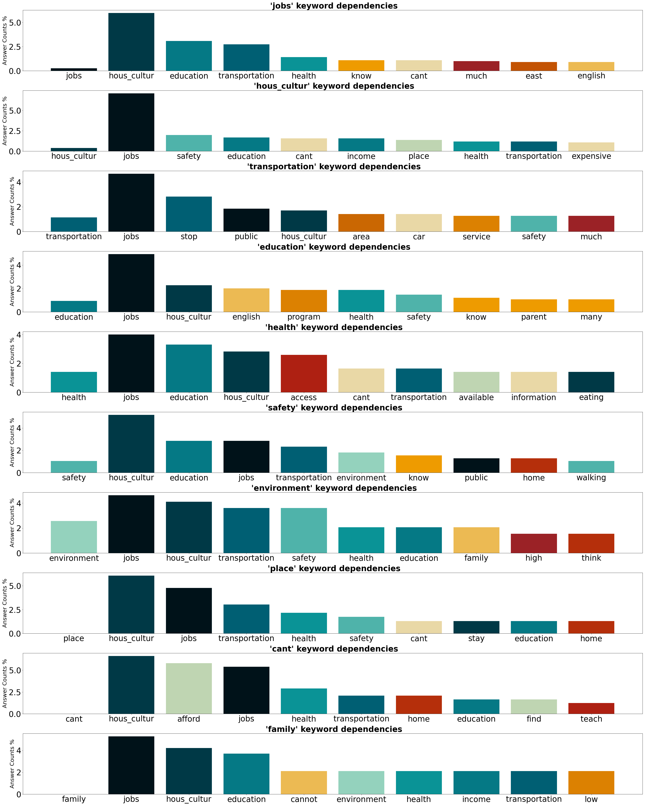
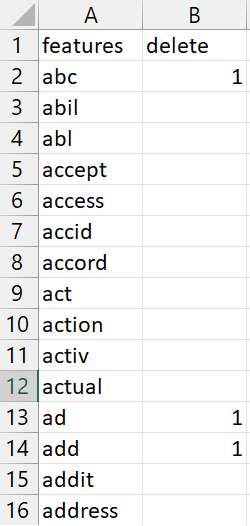
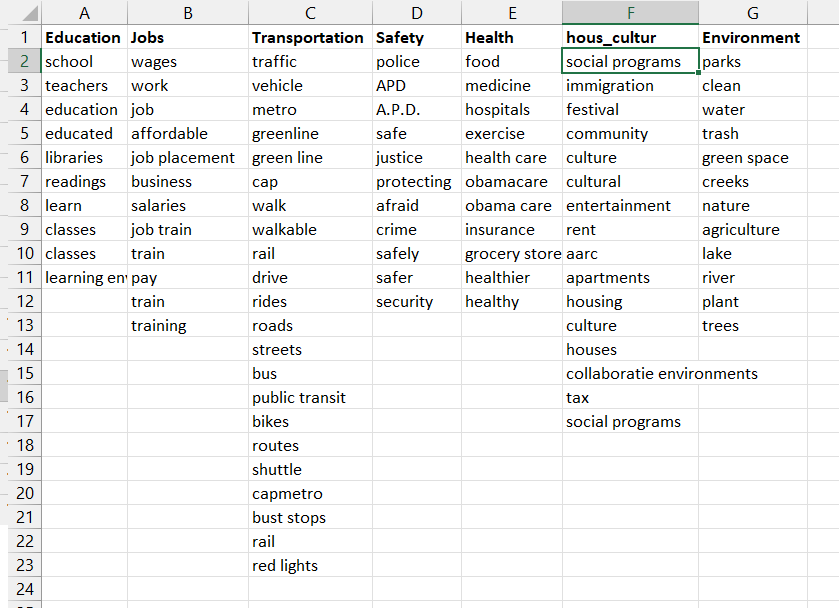
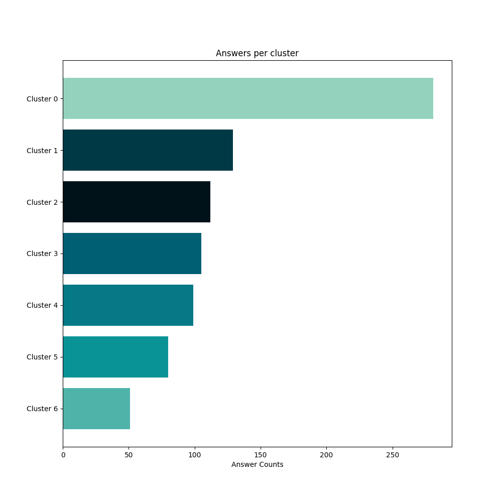
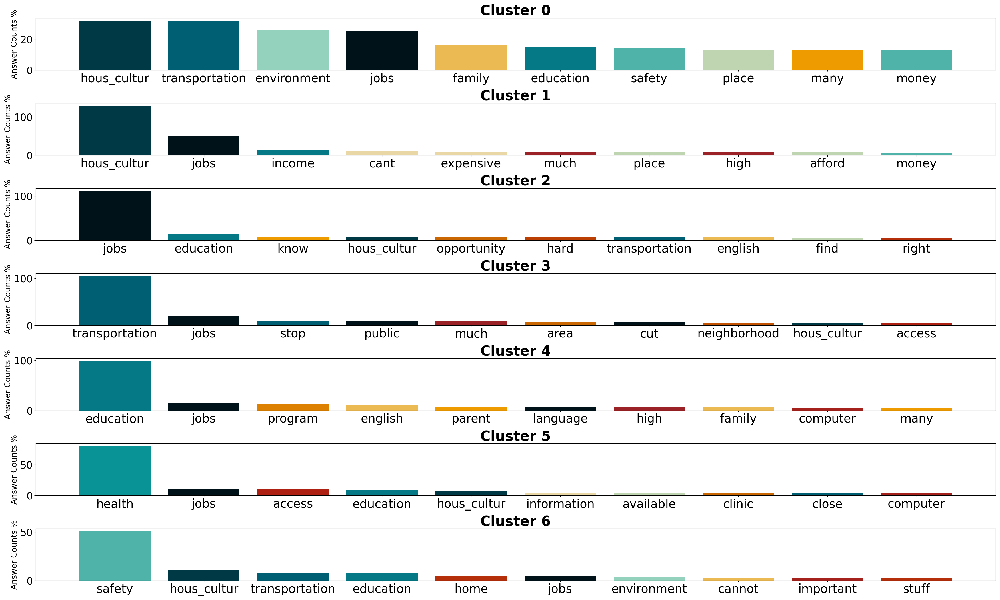
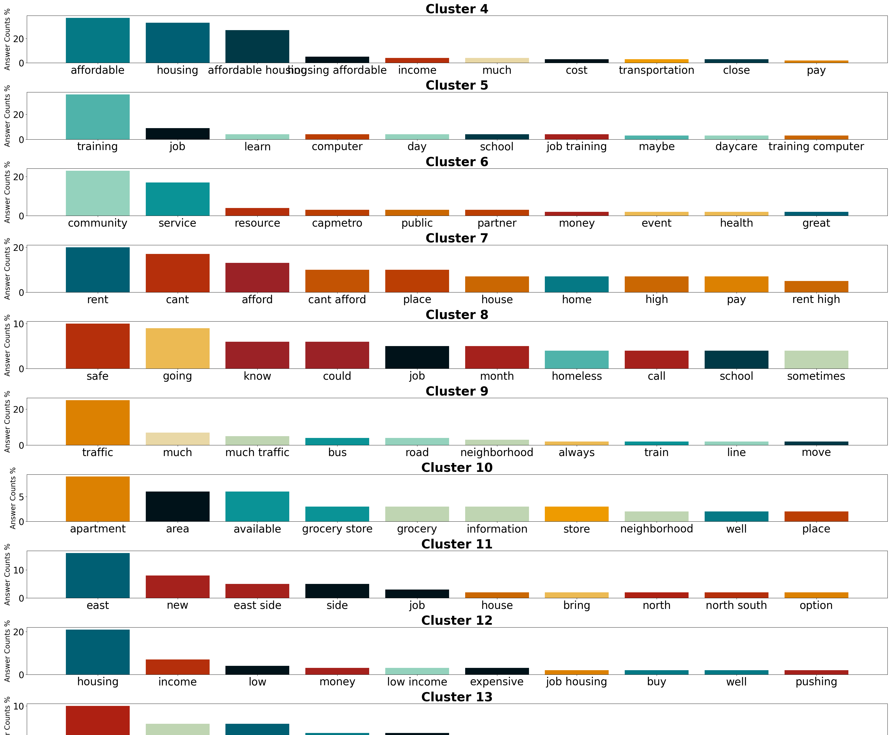

## Case Study:

The following is a preview for a particular dataset.

(For better viewing of the graphs make sure that images have a white background - night mode is off)

([Here](#1-12) you can find some explantions for terms used in the following descriptions)

### About the dataset:
The dataset (found [here](https://catalog.data.gov/dataset/spirit-of-east-austin-feedback-data)) is from an efford by the Health Equity and Community Engagement department of the city of Austin Texas to identify the needs of the community, in the summer of 2017. The open-ended answers were isolated and used.

#### Access & Use of data:
'Public: This dataset is intended for public access and use.
Appreciation for the Health Equity and Community Engagement department for sharing their data openly.

### Context

For better analysis using this tool, knowledge of the context analyzed is necessary. Two runs on the same dataset are demonstrated with different context:

#### Run-1: Analyzing answers in general categories

- Open-ended answers were classified from the organization into seven categories: 'Education', 'Jobs', 'Transportation', 'Safety', 'Health', 'Housing Culture' and 'Environment'. Thus, 7 clusters were chosen for this run, having the specific analysis in mind. 
- Using the topic_dictionary.xlsx, keywords from answers in each category were used in the topic_dictionary.xlsx, in order to cluster answers into these categories.
- Features with zero-information were manually added in the 'stop_word_list.xlsx' first column (with the number 1 in the column next to them) in order to be ignored from the analysis

#### Run-2: Digging deeper into the subject matter by increasing cluster number
- Modifying only topic_dictionary to only synonyms, and increasing the number of clusters from 7 to 34, reveals more sub-categories hidden in the answers.

### Feature analysis of answers:

- Identify main features of the corpus

A bar chart showing the most frequently used features per answer, and the answer count per feature enables the user to easily identify terms and topics in the corpus.

The graph shown is for Run-1 on the dataset described. The 7 categories appear as the top 7 features used by the responders (based on the topic_dictionary created).

- Uncover Hidden Patterns

What are the correlations between various features? A bar chart per feature is made, by isolating answers that include that feature, and identifying all the other features used in the answers.  

**The first bar to each subplot refers to the number of answers that include only the chosen feature, and no other.

The graph shown is for Run-1 on the dataset described. Focusing on feature "jobs", we see that 5% of answers that include this feature, also include the feature "housing_culture", around 3% of them includes feature "education" and less than 3% of these answers include other features. Very few answers include only the feature "jobs" and no other, as can be seen from the first bar that is less than 0.5 %.

- Remove Noise and Zero-Information Features for Cleaner Data Analysis

By completing a word in stop_word_list.xls file (in the first column), and writing 1 next to it, it is removed from the analysis. this way one can remove zero-information features from the analysis.

- Group and Replace Features for More Focused Analysis

The topic_dictionary.xlsx determines what features have the same meaning. All words in a column are replaced with the word in the first row. 

For "Run-1", words in the first rows were chosen according to the performed classifications. Words to be grouped were chosen by skimming the text.

### Clustering the answers

- Cluster Similar Responses for a Clear Understanding of Feedback

Based on the chosen features, clustering is performed (K-Means clustering is used). The user must choose a number of clusters. The 'correctness' of the clusters number is relevant to the context. Smaller number of clusters reveals more general topics, while larger numbers (run-2) can reveal more subcategories.

- Viewing the Overall Distribution of Clusters and Answer Counts

A car chart is prepared showing the distribution of answers to clusters.

Note: General guideline 1: when choosing a cluster number, it is advised that most answers are distributed among many clusters and not a single cluster. Depending on context this may not apply. 

- Uncover the Topics of Feedback by drilling down into Individual Clusters

For each cluster, a subplot shows the top features (based on answer counts). This can reveal topics covered by answers in that cluster.

- Run 2: Identify more subcategories

Modifying some of the parameters can reveal more sub-categories: Removing the categories from the topic_dictionary (except synonyms), and increasing the number of clusters from 7 to 35, more subcategories are revealed:

i.e. From features in cluster 7, one can distinguish that some can't afford to pay the rent. 

Note: General guideline 2: choose a number such that:
   - features that are in a cluster cover the same topic
   - no two clusters have similar features that describe the same topic.
   - Modify cluster number and dictionaries accordingly.

Requirements:
   - files:
      - answers to be analyzed in an .xlsx file named 'raw_data.xlsx' of the following structure:
            - question is on the first row
            - answers for one open-ended question below the question
            - one answer per row, all in the first column

      - three .xlsx files:
         (1) 'topic_dictionary.xlsx'
               operation described above
      
         (2) 'stop_word_list.xlsx'
               operation described above

         (3) 'parameters.xlsx': a file that has the values for the necessary parameters for the program to run. These parameters are:
            - PRINT_INFO : print details - usefull when tuning with dictionaries (True/False)             
            - CLUSTER_NO : number of clusters (integer)             
            - TOP_FEATURES : number of top features to keep (integer)
            - REPORT : Produce clustering report file named 'clustering_report.xlsx' (True/False)
            - SAVE_FEATURES : Saves identified features in features.xlsx (True/False)
            - PREDICT : Option to predict the cluster of an input sentence by the user and it's score (True/False) - currently not working correctly
            - N_GRAMS_MIN : Define minimum N-gram to consider as feature (int)
            - N_GRAMS_MAX : Define maximum N-gram to consider as feature (int)
            - PORTER_OR_LEMMATIZER : choose porter stemmer (1) or WordNetLemmatizer (2)
            - SAVE_VIZ : save vizualizations in current folder (True/False)

   - dependencies:
      python 3, numpy, pandas, nltk, scikitlearn

#### Terms used:

'n-gram': 'a contiguous sequence of n items from a given sample of text' [source](https://en.wikipedia.org/wiki/N-gram). Can be 1-gram -> 1 word, 2-gram -> 2-word sequence, n-gram-> n-word sequence.

'feature': referes to a term (can be an n-gram) used that is characteristics to a group of answers and is readable by a machine. This can some times be correct-spelling words, understandable by humans (if lemmatization is used), or not (if porter-stemmer is used)

'lemmatization': "the process of grouping together the inflected forms of a word so they can be analysed as a single item, identified by the word's lemma" [source](https://en.wikipedia.org/wiki/Lemmatisation)

'stemming': 'the process of reducing inflected (or sometimes derived) words to their word stem, base or root form—generally a written word form' [source](https://en.wikipedia.org/wiki/Stemming)

'Porter-Stemmer': A stemming algorithm  written by Martin Porter in 1980, widely used.

