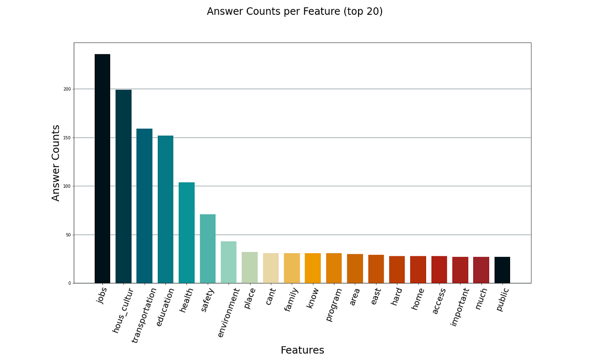
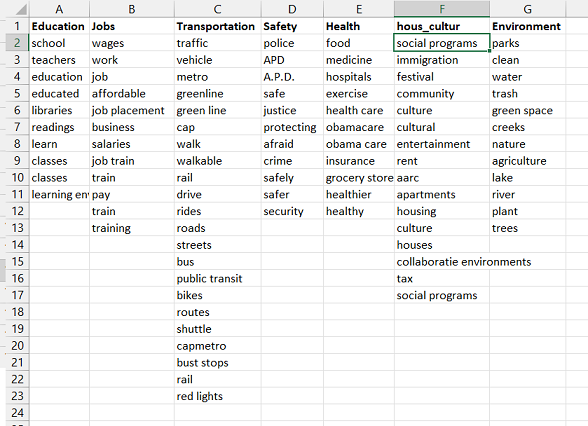
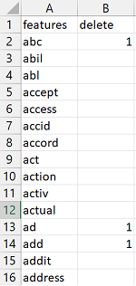
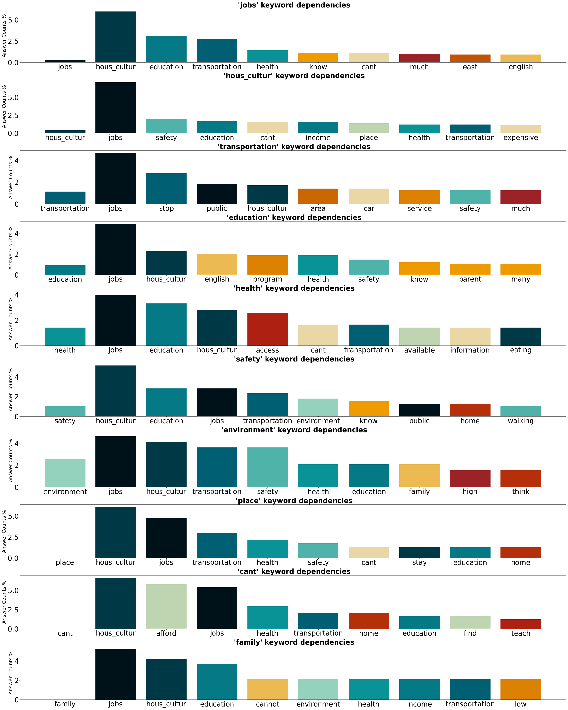
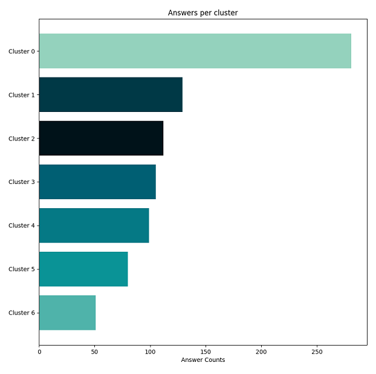
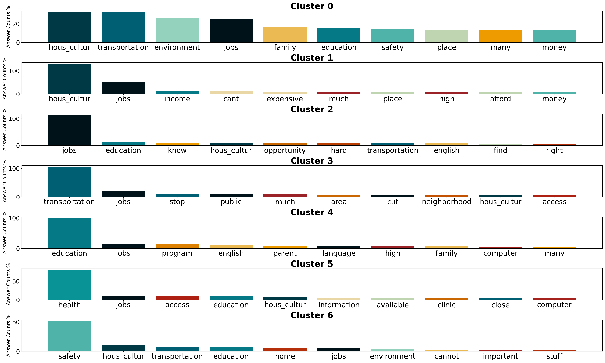
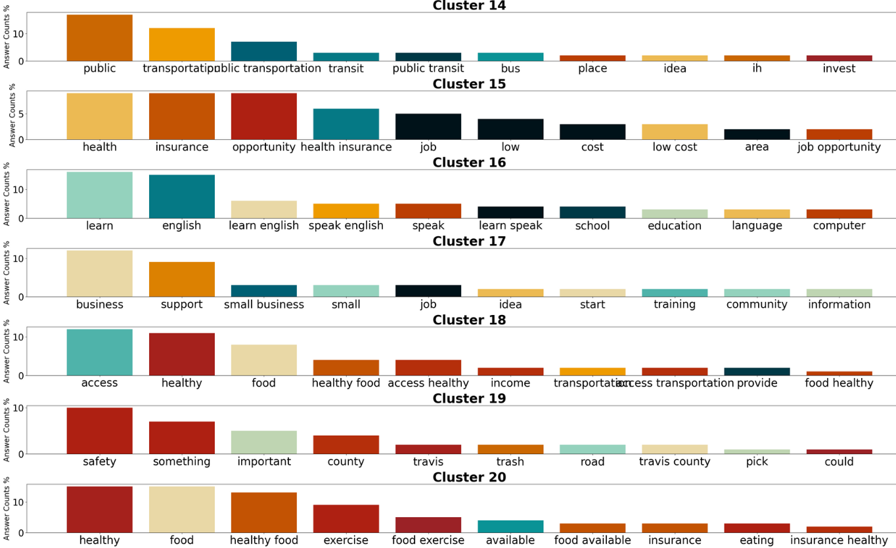

# Analysing Open-Ended Feedback: Discover Insights with this Survey Analysis Tool

A repository for a tool that can assist in analyzing open-ended questions. The user can easily identify topics covered in open-ended questions.

# Main characteristics:

## Analyse features included in the corpus

- Identify Keywords and Features in Open-Ended Survey Responses.
- Uncover Hidden Patterns in Survey Data
- Remove Noise and Zero-Information Features for Cleaner Data Analysis
- Group Features That Belong to the Same Category

## Analyse clusters
- View the Overall Distribution of Clusters per Answer Counts.
- Uncover Topics by Drilling Down Into Top Features per Cluster.

## Evaluate results from reports
- Review identified cluster for each answer, with a relevance score.
- Review all clusters, together with their main features.

## Behind the code

The code does the following:

1. Filters out stop-words and applies Porter-stemmer (option for lematization).
2. Vectorizes answers (using TFIDF vectorizer).
3. Clusters the answer vectors using K-means clustering.
4. Based on a normalized eucledean distance (between answer vectors and cluster centroids) calculates a score for each asnwers per cluster. This indicates the relevance of the answer to the cluster.

## Requirements:

Four files are necessary:
   -  'raw_data.xlsx' : this includes answers to be analyzed  the following structure:
      - question is on the first row
      - answers for one open-ended question below the question
      - one answer per row, all in the first column

   - 'parameters.xlsx': a file that has the values for the necessary parameters for the program to run. These parameters are:
      - PRINT_INFO : print details (True/False). Print details for the status while running.
                   
      - CLUSTER_NO : number of clusters (integer)             
      - TOP_FEATURES : number of top features to keep (integer). The user can choose the number of top features to keep for vectorization and clustering. Features are sorted based on the number of answers for each feature. This number defines how many features to keep for further analysis and clustering.
      - REPORT : Save a clustering report in file 'clustering_report.xlsx' (True/False)
      - SAVE_FEATURES : Saves identified features in features.xlsx (True/False)
      Can be usefull when identifying features to add in the 'stop_words_list.xlsx'
      - PREDICT : Option to write a sentence, and predict it's cluster and score (True/False)
      - N_GRAMS_MIN : Define minimum [n-gram](#2-1) to be considered as feature (int)
      - N_GRAMS_MAX : Define maximum n-gram to be considered as feature (int)
      - PORTER_OR_LEMMATIZER : choose porter stemmer (1) or WordNetLemmatizer (2)
      - SAVE_VIZ : save vizualizations in current folder (True/False)
   - 'topic_dictionary.xlsx' : features that are grouped together are defined here, as described above.
   - 'stop_word_list.xlsx' : features with zero-iformation can be added here, as described above.

- dependencies:
   python 3, numpy, pandas, nltk, scikitlearn, matplotlib

([Here](#1-1) you can find explanations for some of the technical terms used)

-------------------------------

# Case study:

The following shows insights gained from using the tool for a particular dataset.

### The dataset:
   
The dataset (found [here](https://catalog.data.gov/dataset/spirit-of-east-austin-feedback-data)) is from the Health Equity and Community Engagement department of the city of Austin Texas in an efford to identify the needs of the community, in the summer of 2017. The open-ended answers were isolated in the 'raw_data.xlsx' file, according to the above requirements.

#### Access & Use of data:
'Public: This dataset is intended for public access and use.'
Appreciation for the Health Equity and Community Engagement department for sharing their data openly.

## Context is relevant

Knowledge of the context of the answers is necessary in order to use the tool more efficiently. The analysis below demonstrates briefly insights gained from the particular dataset. The results could have been much better coming from a user with a deeper understanding of the topics and more involvement with the community. 

Two runs on the same dataset were performed in order to demonstrate how general topics (Run-1) and sub-categorical topics (Run-2) can be revealed.

### Run-1: Analyzing answers in general categories

The open-ended answers were classified from the organization into seven categories: 'Education', 'Jobs', 'Transportation', 'Safety', 'Health', 'Housing Culture' and 'Environment'. In order for the results to be closer to this goal, the number of cluster was chosen to be 7. 

#### Group Features That Belong to the Same Category

   - Using the 'topic_dictionary.xlsx', words from each category were grouped together:  

      How this works: all words in a column are replaced with the word in the first row. Words in the first rows were chosen according to the categories of interest.

#### Remove Noise and Zero-Information Features for Cleaner Data Analysis

- Features with zero-information were manually added in the 'stop_word_list.xlsx' in order to be ignored from the analysis.   

   How this works: by completing a word in 'stop_word_list.xls' in the first column, and writing 1 next to it, it is removed from the analysis.

### Feature analysis of answers:

- Identify main features of the corpus

   A bar chart showing answer counts for the top features enables the user to easily identify terms and topics in the corpus.
   
   

   The 7 categories appear as the top 7 features used by the responders (based on the 'topic_dictionary.xlsx').

- Uncover Hidden Patterns

   What are the correlations between various features? A bar chart per feature is made, by isolating answers that include that feature, and identifying all the other features used in the answers. Color-coding of the features allows the user to identify dominant features easily.

   **The first bar to each subplot refers to the number of answers that include only the chosen feature, and no other.

   Focusing on the first bar chart, that analyzes the feature "jobs", we see that 5% of answers that include this feature, also include the feature "hous_cultur", around 3% of them includes "education" and less than 3% of these answers include other features. 

   In most of the bar charts, the feature 'jobs' (black bar) can be identified as the second most frequent feature (around 5 % of answers from most features). 

### Clustering the answers

- Viewing the Overall Distribution of Clusters and Answer Counts

   A bar chart is prepared showing the distribution of answers per cluster.

- Uncover the Topics of Feedback by drilling down into Individual Clusters
   
   

   For each cluster, a subplot shows the top features (based on answer counts). This can reveal topics covered by answers in that cluster. Most of the clusters are representative of the topics chosen, as evident by the dominant feature in each cluster. 

### Run-2: Digging deeper by increasing cluster number

- Increasing the number of clusters from 7 to 34 and removing grouped features (from the 'topic_dictionary.xlsx'), can reveals more sub-categorical topics. These topics are revealed when looking at top features per cluster.

   

   Some topics of interest revealed are: 
   - public transportation (Cluster 14) 
   - health insurance (Cluster 15)
   - learn english (Cluster 16)
   - access to healthy food (Clusters 18 & 20)

-----------------------

#### Terms used:

- 'n-gram': 'a contiguous sequence of n items from a given sample of text' [source](https://en.wikipedia.org/wiki/N-gram). Can be 1-gram -> 1 word, 2-gram -> 2-word sequence, n-gram-> n-word sequence.

- 'feature': referes to a term (can be an n-gram) used that is characteristics to a group of answers and is readable by a machine. This can some times be correct-spelling words, understandable by humans (if lemmatization is used), or not (if porter-stemmer is used)

- 'lemmatization': "the process of grouping together the inflected forms of a word so they can be analysed as a single item, identified by the word's lemma" [source](https://en.wikipedia.org/wiki/Lemmatisation)

- 'stemming': 'the process of reducing inflected (or sometimes derived) words to their word stem, base or root form—generally a written word form' [source](https://en.wikipedia.org/wiki/Stemming)

- 'Porter-Stemmer': A stemming algorithm  written by Martin Porter in 1980, widely used.

-----------------------

